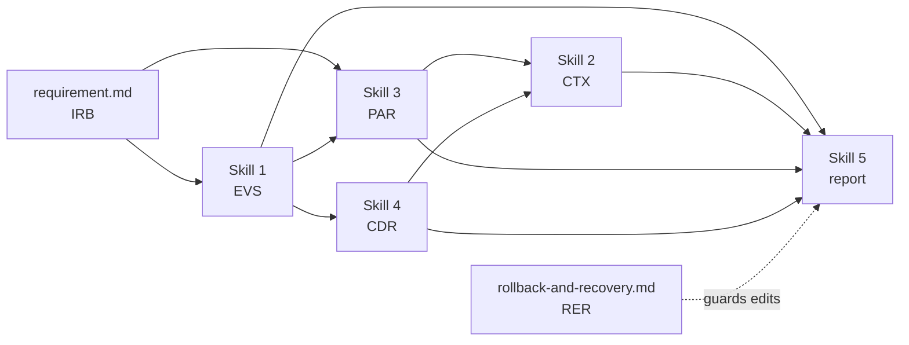

# SKILL INDEX: Engineering Investigation Skills

Seven bounded, reviewable skills shared by the agents in
[../agents/](../agents/README.md). Each skill has a single responsibility, a hard
scope boundary, a typed output artifact and a review checklist.

## Core skills

| # | Skill | Artifact | Load when you need to... |
|---|---|---|---|
| 1 | [Log & Evidence Parsing](skill-1-log-evidence-parsing.md) | `EVS-*` | Turn raw logs, error messages, test and validation results into citable, deduplicated signals with a timeline |
| 2 | [Code Search & Context Retrieval](skill-2-code-search-context-retrieval.md) | `CTX-*` | Find the relevant code and its callers, callees, tests and recent changes, pinned to a commit SHA |
| 3 | [Historical Pattern Lookup](skill-3-historical-pattern-lookup.md) | `PAR-*` | Check whether this failure, test case or decision already exists in prior art |
| 4 | [Configuration Analysis](skill-4-configuration-analysis.md) | `CDR-*` | Resolve effective configuration and diff it against a known-good baseline |
| 5 | [Structured Report Generation](skill-5-structured-report-generation.md) | report | Synthesise the artifacts above into one bounded, fully cited deliverable |

## Cross-cutting skills

| Skill | Artifact | Load when you need to... |
|---|---|---|
| [Investigation Requirement Gathering](requirement.md) | `IRB-*` | Frame and freeze what an investigation must answer, before any debugging starts |
| [Rollback and Recovery](rollback-and-recovery.md) | `RER-*` | Checkpoint before edits, revert failed attempts, and enforce a repair-attempt budget |

## Pipeline

## Selection guide

| Question in front of you | Skill |
|---|---|
| "What actually happened at runtime?" | 1 |
| "Where in the code does this live, and what touches it?" | 2 |
| "Have we seen this before?" | 3 |
| "Why does it work here but not there?" | 4 |
| "How do I write this up so a reviewer can audit it?" | 5 |
| "What exactly are we being asked to investigate?" | `requirement.md` |
| "How do I undo this safely?" | `rollback-and-recovery.md` |

## Shared contract

Every skill in this folder guarantees:

1. **Bounded** - an explicit out-of-scope list, a stated budget (records, files, questions, attempts) and a terminal status such as `INSUFFICIENT`, `NOT_FOUND`, `NO_PRECEDENT`, `PARTIAL` or `INCOMPLETE`.
2. **Evidence-first** - no output line without a citation: `path#Lstart-Lend @ SHA`, run ID, ticket ID or doc section.
3. **Non-causal** - skills report what the artifacts say; causal conclusions belong to the owning agent.
4. **Redacted** - credentials, tokens and PII are replaced before any value leaves the skill.
5. **Reviewable** - one fixed-schema output artifact plus a checklist a peer can run without redoing the work.

## Consumers

| Agent | Skill order |
|---|---|
| [Requirements Agent](../agents/requirements-agent.agent.md) | 3, 1, 2, 4, 5 |
| [Debugging Agent](../agents/debugging-agent.agent.md) | 1, 3, 4, 2, 5 |
| [Feature Agent](../agents/feature-agent.agent.md) | 3, 2, 4, 1, 5 |
| [Refactoring Agent](../agents/refactoring-agent.agent.md) | 2, 3, 1, 4, 5 |
| [Documentation Agent](../agents/documentation-agent.agent.md) | 3, 2, 4, 1, 5 |
