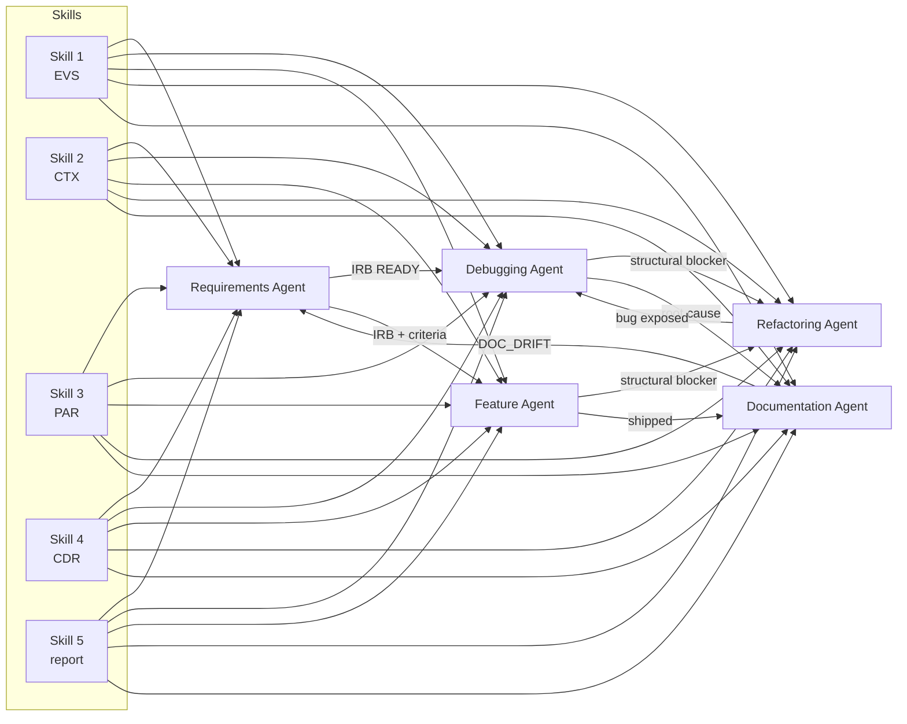

# AGENTS

Five specialist agents that compose the engineering investigation workflow. Each
agent is bounded (explicit out-of-scope list, budgets, stop conditions), reviewable
(fixed output contract + review checklist), and reuses the shared skills in
[SKILLS/](../SKILLS).

| Agent | Folder | Deliverable | Entry gate |
|---|---|---|---|
| Requirements Agent | [requirements-agent](requirements-agent/requirements-agent.agent.md) | `IRB` + traceability matrix | Any new request |
| Debugging Agent | [debugging-agent](debugging-agent/debugging-agent.agent.md) | `IR` investigation report | `IRB` status `READY` |
| Feature Agent | [feature-agent](feature-agent/feature-agent.agent.md) | `FP` feature proposal | `IRB` with acceptance criteria |
| Refactoring Agent | [refactoring-agent](refactoring-agent/refactoring-agent.agent.md) | `RFP` refactoring plan & record | Green baseline + tests exist |
| Documentation Agent | [documentation-agent](documentation-agent/documentation-agent.agent.md) | `DOC` engineering document | A pinned revision |

## Agent x Skill matrix

Numbers show the order in which each agent invokes the skill (`\u2013` = not used).

| Skill | Requirements | Debugging | Feature | Refactoring | Documentation |
|---|---|---|---|---|---|
| [1 \u2014 Log & Evidence Parsing](../SKILLS/skill-1-log-evidence-parsing.md) | 2 | 1 | 4 | 3 | 4 |
| [2 \u2014 Code Search & Context Retrieval](../SKILLS/skill-2-code-search-context-retrieval.md) | 3 | 4 | 2 | 1 | 2 |
| [3 \u2014 Historical Pattern Lookup](../SKILLS/skill-3-historical-pattern-lookup.md) | 1 | 2 | 1 | 2 | 1 |
| [4 \u2014 Configuration Analysis](../SKILLS/skill-4-configuration-analysis.md) | 4 | 3 | 3 | 4 | 3 |
| [5 \u2014 Structured Report Generation](../SKILLS/skill-5-structured-report-generation.md) | 5 | 5 | 5 | 5 | 5 |

Two cross-cutting skills are available to every agent:

- [requirement.md](../SKILLS/requirement.md) \u2014 investigation requirement gathering (`IRB`)
- [rollback-and-recovery.md](../SKILLS/rollback-and-recovery.md) \u2014 checkpoint, revert, attempt budgets (`RER`)

## Artifact flow

Skills emit typed artifacts; agents consume them and emit a single reviewable deliverable.

## Artifact IDs

| ID | Artifact | Produced by |
|---|---|---|
| `EVS-*` | Evidence Set | Skill 1 |
| `CTX-*` | Context Pack | Skill 2 |
| `PAR-*` | Prior-Art Report | Skill 3 |
| `CDR-*` | Configuration Delta Report | Skill 4 |
| `IRB-*` | Investigation Requirement Brief | Requirements Agent |
| `IR-*` | Investigation Report | Debugging Agent |
| `FP-*` | Feature Proposal | Feature Agent |
| `RFP-*` | Refactoring Plan & Record | Refactoring Agent |
| `DOC-*` | Engineering Document | Documentation Agent |
| `RER-*` | Recovery Execution Record | Rollback & Recovery skill |

## Shared invariants

Every agent in this folder obeys the same rules:

1. **Bounded** \u2014 explicit in/out of scope, question budget, change budget, and a terminal `BLOCKED` / `NOT_SAFE` state.
2. **Evidence-first** \u2014 no claim without a citation (`path#Lstart-Lend @ SHA`, run ID, ticket ID or doc section).
3. **Reversible** \u2014 checkpoint before edits; every change has a written revert step.
4. **Reviewable** \u2014 one fixed-schema deliverable plus a review checklist a peer can run.
5. **Handoff, don't sprawl** \u2014 work outside an agent's scope is handed to the owning agent, never absorbed.

## Using these with VS Code

VS Code discovers custom agents from `.github/agents/*.agent.md`. To activate one
here, copy or symlink the desired `*.agent.md` file into `.github/agents/`, or move
the folder contents there. Skills are discovered from `SKILL.md` files; the files in
[SKILLS/](../SKILLS) carry compatible YAML frontmatter (`name`, `description`).
